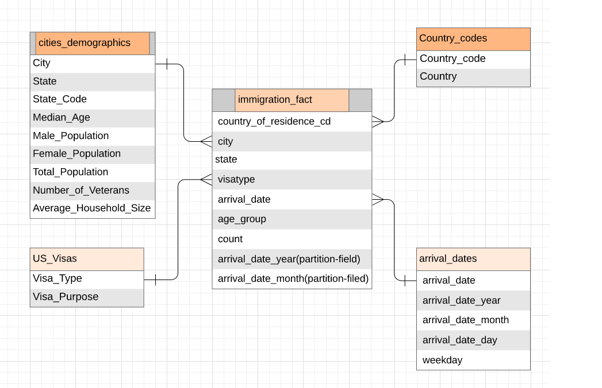
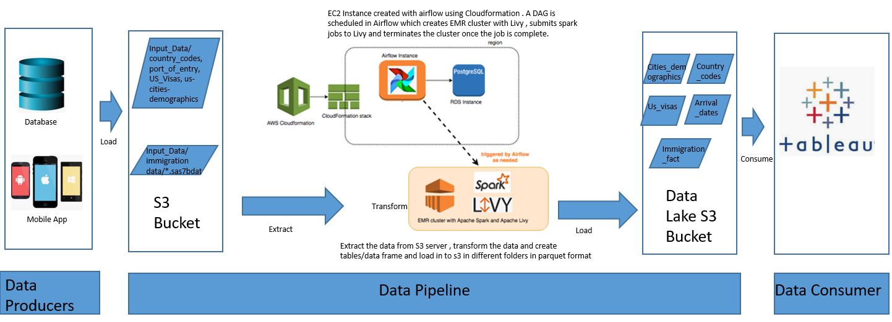
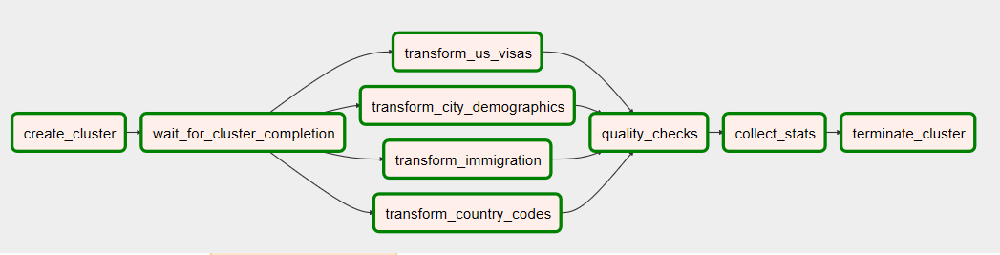
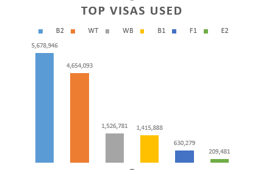
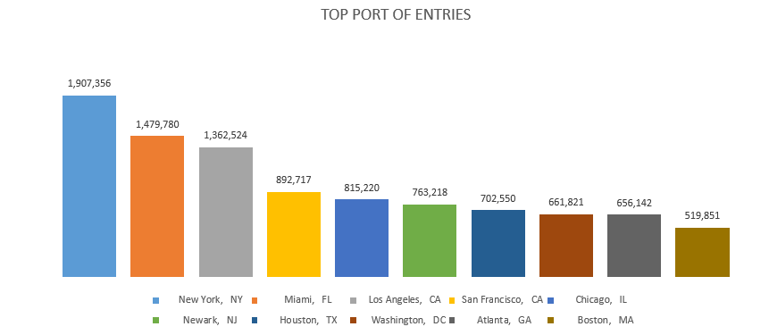
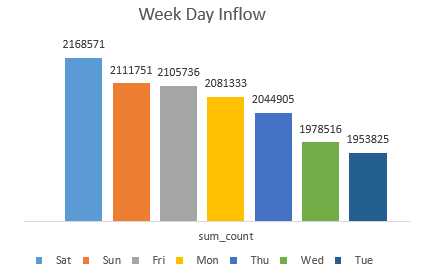
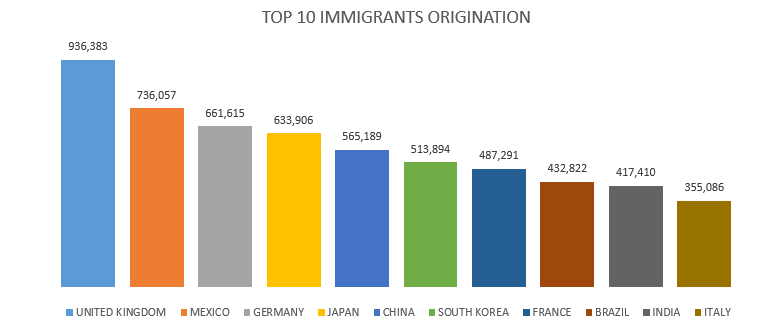

# Project Title: Immigration Data Lake- Capstone Project
## Introduction

Each year lot of immigrants comes to US for various reasons and US Government issues visas according to the necessity of the travel. DHS issues a i94 for each immigrant and records the details of the each person upon arrival. There is significant amount of inflows to US , so to better understand inflows and allocate resources accordingly US Government requies a data lake to analyze the data. Some of the details they would need are mentioned below.

- Redirect the air traffic to differnt cities
- Allocate DHS memebers in the specific portsof entries based on the need
- Which days there is more inflow
- Which time of the year there are more inflows
- What type of visa is used more
- From which country there is inflow

As a data engineer build an ETL pipeline that extracts their data from S3, processes them using Spark, and loads the data back into S3 as a set of dimensional/fact  tables. This will allow  US governments to continue finding insights .

## Project Description

In this project, create a data lake  and ETL pipeline for this analysis. Do data modeling for data to be hosted on S3 and build an ETL pipeline . To complete the project, define fact and dimension tables for a star schema for a particular analytic focus, and write an ETL pipeline that extract data from S3 bucket transforms fact and dimentions table in S3.

## Getting Started

- Create AWS account
- using cloudformation , create a Ec2 stack with airflow (use airflow.yaml)
    Refer steps mentioned in(https://aws.amazon.com/blogs/big-data/build-a-concurrent-data-orchestration-pipeline-using-amazon-emr-and-apache-livy/)
 
## Project Steps
1. Move the data in to S3 bucket( Use files_to_S3.py script using conf.cfg which also creates the bucket udacity-immigration-project)
2. ssh the EC2 cluster created and start airflow scheduler
3. create immigration_dag.py with the tasks to create cluster, submit spark jobs and terminate cluster.
4. Create pyspark scripts for reading data from S3 , clean the data write the data to S3 (ouput_folder-data lake in S3/udacity-immigration-project).
5. Below are the steps to be followed when cleaning the data.
    - Remove unwanted characters in the columns
    - Convert the columns data type to correct format
    - rename fields so to properly load the data in parquet (like no spaces between in the column names)
    - Remove duplicate rows
    - Remove duplicate rows based on the key fields.
6. Create quality checks script to host the checks on the data model. Should throw an error when check fails.
7. Create a script to read the output data and collect the stats. (write the data to folder summary-stats in S3/udacity-immigration-project)
8. Run the dag (runs yearly) which creates ouptut folder and summary-stats folder with required data.

### Data 

The Data resides in S3 bucket with immigration data in sas7bdat format and rest all the data in csv format.

#### i94 immigration data 

The data is for the year 2016 with each file for each month. Layout for the file ("I94_SAS_Lables_Description.SAS")
This data comes from the US National Tourism and Trade Office and pulled from [here](https://travel.trade.gov/research/reports/i94/historical/2016.html)

#### country code csv file 

The csv contains the contry code and country name used by DHS

#### port of entry csv file

This file contains the port of entry code , city , state

#### Us visa csv file

This file contains the visa type and purpose of the visa.

#### Us cities Demographics csv file

this file contains all the demographics of each city in US. You can get the data from [here](https://travel.trade.gov/research  /reports/i94/historical/2016.html)

## Datalake - Star Schema

#### ER Diagram

ER diagram depicting the tables star schema with fact and dimensions.
star shcema should suffice the purpose.

#### Tables
Below are the tables defined

1. Fact Table

 1. immigration_fact - i94 records represent only air travel
   a. Data Dictionary
       Country_of_residency_code, city, state, visa_type, arrival_date, age_group, count, arrival_date_year, arrival_date_month
   b. How it is built:
       - Drop dulicates on the rows from immigration file
       - extarct the data only for air travel
       - remove junk data in different columns and convert the columns to correct format
       - Change the sas date format to normal date format 
       - Join the port of entry file and immigration file on port to get the city and state
       - extract the dates for arrival date dimension table
       - Group by fields (Country_of_residency_code, city, state, visa_type, arrival_date, age_group, arrival_date_year, arrival_date_month) 
       and extract count 
       - Append the table by partitoning on arrival_date_year, arrival_date_month
       
2. Dimension Tables

 1. us_visas - all the us visa and purpose of the visa
    a. Data Dictionary
        visa_type, visa purpose
    b. How it is built:
        - Use us visa file,drop dulicates on the visa type
        - remove any junk data in the columns
        - Overwirte the table 
    
 2. country_codes - country and the code for the country
   a. Data Dictionary  
       country_code, country
   b. How it is Built:
        - Use US country code file,drop dulicates on the country code
        - remove any junk data in the columns
        - Overwirte the table 
       
 3. cities_demographics - city and its demographics
    a. Data Dictionary
       city, state, state_code, median_age, male_population, female_population, total_population, number_of_veterans, average_household_size
    b. How it is build:
        - Use City demographics file drop dulicates on the city and state
        - remove any junk data in the columns
        - Extract the columns mentioned in the data dictionary 
        - rename the columns name to correct format
        - Overwirte the table 
        
 4. arrival_dates - arrival date in immigration broken into specific units
    a. Data Dictionary 
        arrival_date, arrival_date_year, arrival_date_month, arrival_date_day, weekday
    b. How it is built:
        - Use arrival date extracted from immigration file,  drop dulicates on the arrival date 
        - Extract the columns mentioned in the data dictionary using the arrival date
        - Append the table 
    

#### Why Data Model?

The data model is created as mentioned above to get answers for some of questions below.

1. To get the information on which citiies inflows are more and understand the city demographics
    - We can join the fact table and cities demographics dimension table. 
2. To get the information on the visa used the most 
    -  We can get the information by joining the fact table with visa dimension table to get the visa details.
3. To get the week day and which part of the year the inflows are more
    - we can get the information from joining the fact table and arrival dates dimension table
4. To get the information on the inflows from which country 
    - we can get the information from joining the fact table and country code dimension table

## ETL 

#### Data Pipeline

pipeline

EC2
#### Dag
Immigration dag (dags/immigration_dag.py) created as below to create the data lake extracting the data from s3.

Tasks used in the dag (executed in order mentioned above)

a. Create_cluster
    this task is used to create the cluster and returns the cluster id
    
b. wait_for_cluster_completion
    this task waits until the cluster is created . once the cluster is created task gets completed.
    
c. transform_us_visas
    this task submits the spark script (dags/transform/us_visas.py) to EMR using livy which extracts the us visa file, transform and loads to S3 in parquet
    
d. transform_city_demographics
    this task submits the spark script  (dags/transform/cities_demographics.py) to EMR using livy which extracts the cities demographics file, transform and loads citties_demographics dimension table to S3 in parquet 
    
e. transform_immigration
    this task submits the spark script  (dags/transform/immigration.py) to EMR using livy which does below 
    - extracts the immigration fie, airports file ,joins the files, transforms
    - extracts arrival date and transforms 
    - loads immigration_fact  and arrival date dimension to S3 in parquet
    
f. transform_country_code 
    this task submits the spark script  (dags/transform/country_codes.py) to EMR using livy which extracts the country  file, 
    transform and loads country_code dimension table to S3 in parquet
    
g. quality_checks
    this task submits the spark script (dags/transform/quality_checks.py) to EMR using livy which checks the qulaity of the tables . errors when there are issues with data

h. collect_stats
    this task submits the spark script (dags/transform/collect_stats.py) to EMR using livy which joins tables and get the summary stats for each questions we have and loads to s3 in parquet

i. terminate_cluster
    this task terminates the EMR cluster created

## Any other scripts used 

#### dags/airflowlib/emr_lib.py
Contains all the code required to create cluster, wait for cluster creation, submission of spark job and wait for spark job to complete and terminating the cluster
    
    how to run : this used in the dag and scripts

## Choice of tools Used
1. Cloudformation Stack: This is a faster way to create the resources needed in an automated way. Saving from manual errors and time.
2. Amazon EMR: This is hadoop cluster which can be scaled up and down based on the need.Stores/process the data in distrubuted manner. The EMR cluster is created and terminated dynamically . Which is cost and time effective.
3. Apache Spark: Distrubuted processing framework which can be used with most of databases. This uses in memory processing .
4. Apache Airflow: It is a scheduler which runs the dags in schedule manner. Effective in logging and tracking the status of the dags/tasks.

## Scenarios 

1. What if the data were increased by 100x?

    - stroing the input data and data lakes in S3 which is fault tolerant storage solution from Amazon . S3 is capable of storing huge data and increase in the data will not be an issue. For processing we use EMR with spark which are effecient in processing in distrubuted manner and faster.
    - Also redshift can be used to store the tables.

2. What if we needed to run the pipeline on a daily basis by 7 am every day?
    - we need to change the schedule interval of the dag in airflow.

3. What to do if the database needed to be accessed by 100+ people?
    - Data lake is stored in S3 which can be accessed by many users with Privileges. If the users need to have access the data using sql we can move the data to redshift or users can access the S3 by apache spark.
    - As the users increases we need to scale up the resources required.
    

## Sample Analysis
    Below shows some stats for the year 2016

